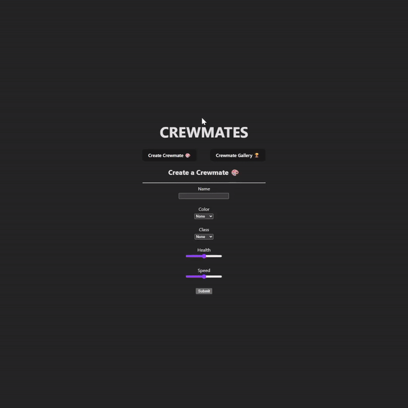

<<<<<<< HEAD
# CodePathSummer2025
<sup> Easy Page View Link <a href="" target="_blank">here</a>.

## 🚀 About
Projects and Activities for CodePath courses Spring 2025. Specifically for courses WEB102 (advanced web development). <br>

## 📜 Documentation
```
/
├── labs/
│   └── .../
├── projects/
│   └── .../
├── README.md
```
* `./labs` folder holds any class session activities and labs done for WEB102 <br>
* `./projects` folder holds the individual projects done for WEB101 <br>
<br>

## 🔔 Credits
This project is created by <a href="https://github.com/abyssaldragonz" target="_blank">Josephine Lee</a>. 
Visit <a href="https://www.codepath.org/" target="_blank">CodePath</a>.
=======
# Web Development Project 7 - *Crewmates*

Submitted by: **Josephine Lee**

This web app: **creates a database to house some RPG crewmates!**

Time spent: **11** hours spent in total

## Required Features

The following **required** functionality is completed:


- [X] **The web app contains a page that features a create form to add a new crewmate**
  - Users can name the crewmate
  - Users can set the crewmate’s attributes by clicking on one of several values
- [X] **The web app includes a summary page of all the user’s added crewmatese**
  -  The web app contains a summary page dedicated to displaying all the crewmates the user has made so far
  -  The summary page is sorted by creation date such that the most recently created crewmates appear at the top
- [X] **A previously created crewmate can be updated from the list of crewmates in the summary page**
  - Each crewmate has an edit button that will take users to an update form for the relevant crewmate
  - Users can see the current attributes of their crewmate on the update form
  - After editing the crewmate's attribute values using the form, the user can immediately see those changes reflected in the update form and on the summary page 
- [X] **A previously created crewmate can be deleted from the crewmate list**
  - Using the edit form detailed in the previous _crewmates can be updated_ feature, there is a button that allows users to delete that crewmate
  - After deleting a crewmate, the crewmate should no longer be visible in the summary page
  - [X] **Each crewmate has a direct, unique URL link to an info page about them**
    - Clicking on a crewmate in the summary page navigates to a detail page for that crewmate
    - The detail page contains extra information about the crewmate not included in the summary page
    - Users can navigate to to the edit form from the detail page

The following **optional** features are implemented:

- [X] A crewmate can be given a category upon creation which restricts their attribute value options
  - e.g., a Dungeons and Dragons class or a development team role (project manager, product owner, etc.)
  - User can choose a `category` option to describe their crewmate before any attributes are specified
  - Based on the category value, users are allowed to access only a subset of the possible attributes
- [X] A section of the summary page, displays summary statistics about a user’s crew on their crew page
  - e.g., the percent of members with a certain attribute 
- [ ] The summary page displays a custom “success” metric about a user’s crew which changes the look of the crewmate list
  - e.g., a pirate crew’s predicted success at commandeering a new galley


The following **additional** features are implemented:

* [ ] List anything else that you added to improve the site's functionality!

## Video Walkthrough

Here's a walkthrough of implemented user stories:



<!--  -->

<!-- Replace this with whatever GIF tool you used! -->
GIF created with ...  
<!-- Recommended tools:
[Kap](https://getkap.co/) for macOS
[ScreenToGif](https://www.screentogif.com/) for Windows
[peek](https://github.com/phw/peek) for Linux. -->
- OBS 
- Ezgif

## Notes

Describe any challenges encountered while building the app.

## License

    Copyright [yyyy] [name of copyright owner]

    Licensed under the Apache License, Version 2.0 (the "License");
    you may not use this file except in compliance with the License.
    You may obtain a copy of the License at

        http://www.apache.org/licenses/LICENSE-2.0

    Unless required by applicable law or agreed to in writing, software
    distributed under the License is distributed on an "AS IS" BASIS,
    WITHOUT WARRANTIES OR CONDITIONS OF ANY KIND, either express or implied.
    See the License for the specific language governing permissions and
    limitations under the License.
>>>>>>> crewmates/master
